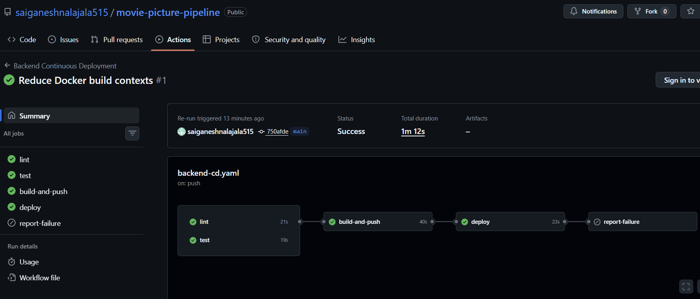
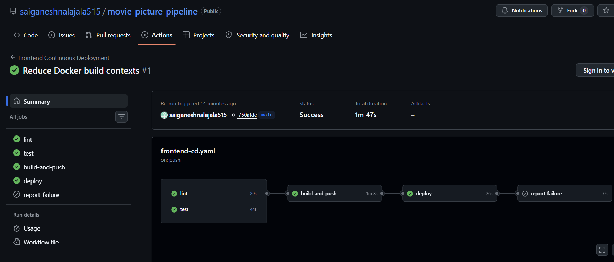
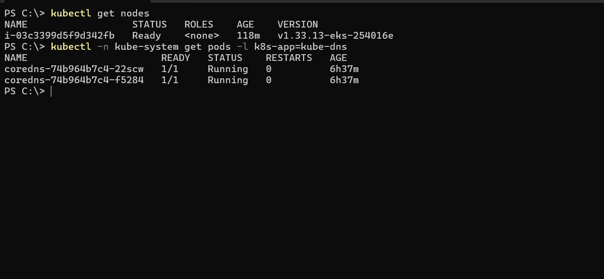
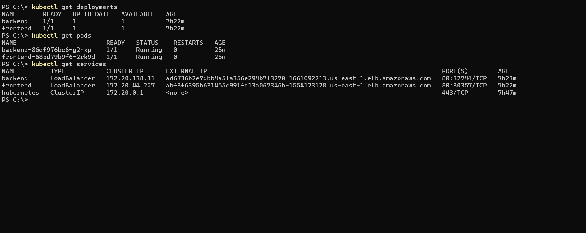
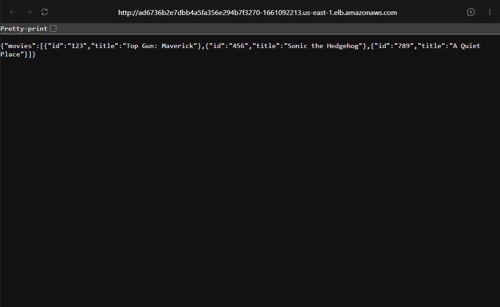
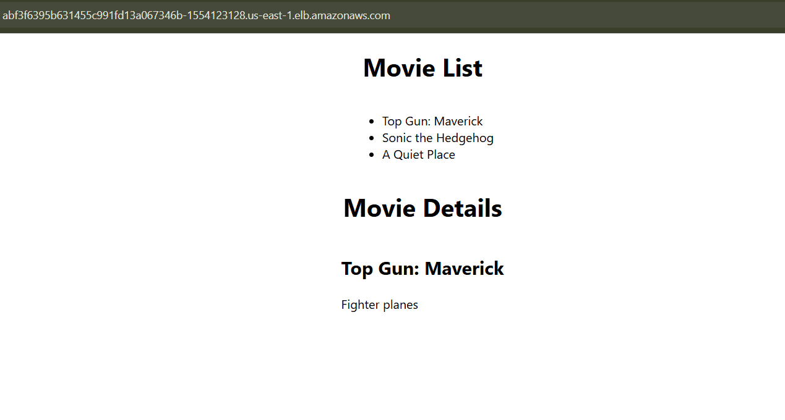
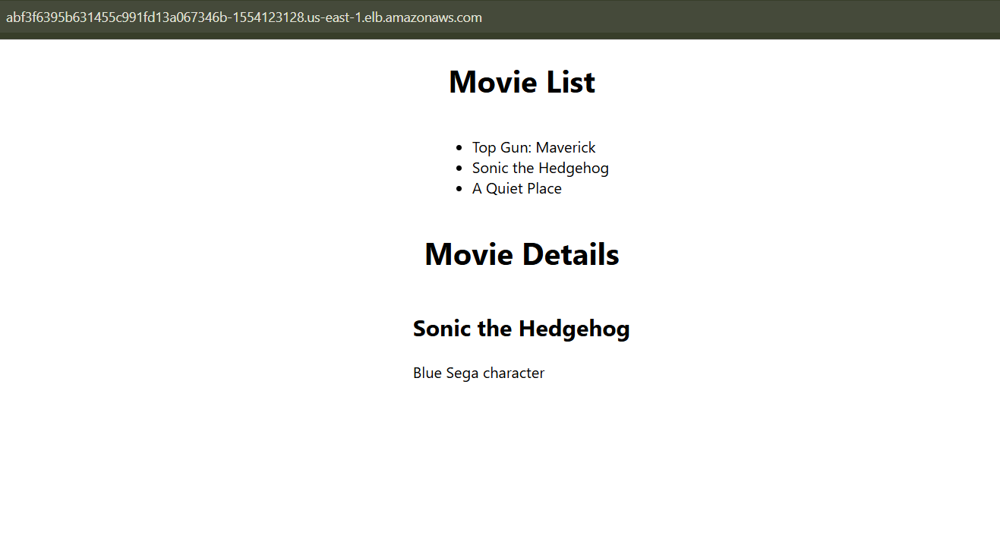
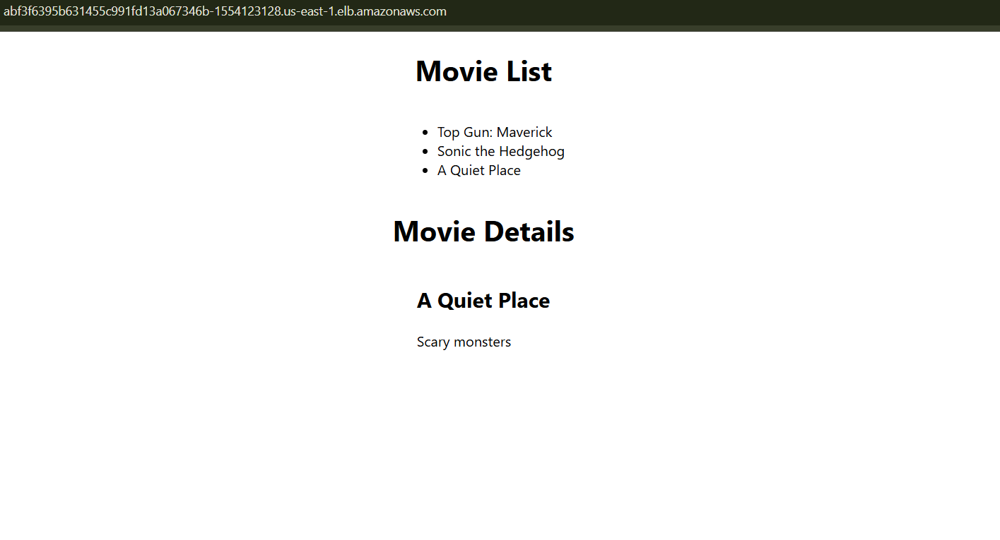

# Project Submission

## Application URLs

- Frontend: [Movie Picture application](http://abf3f6395b631455c991fd13a067346b-1554123128.us-east-1.elb.amazonaws.com)
- Backend: [Movie API `/movies`](http://ad6736b2e7dbb4a5fa356e294b7f3270-1661092213.us-east-1.elb.amazonaws.com/movies)

These endpoints were checked after the EKS node repair. The frontend returned HTTP `200`, and the backend returned HTTP `200` with the movie list.

## Deployment status

```text
Node group:            udacity-fixed
Kubernetes node:       Ready
CoreDNS:               2/2 Running
Backend deployment:    1/1 Available
Frontend deployment:   1/1 Available
Backend API:           HTTP 200
Frontend application:  HTTP 200
```

## Workflow files

- `.github/workflows/frontend-ci.yaml`
- `.github/workflows/backend-ci.yaml`
- `.github/workflows/frontend-cd.yaml`
- `.github/workflows/backend-cd.yaml`

## GitHub settings required before running CD

- Actions secret `AWS_ACCESS_KEY_ID`
- Actions secret `AWS_SECRET_ACCESS_KEY`
- Repository variable `BACKEND_API_URL`

The credential values are encrypted by GitHub. No access key ID, secret access key, or session token value is included in any workflow or source file.

## Successful deployment evidence

- Backend CD run: [Backend Continuous Deployment #1](https://github.com/saiganeshnalajala515/movie-picture-pipeline/actions/runs/31509484946)
- Frontend CD run: [Frontend Continuous Deployment #1](https://github.com/saiganeshnalajala515/movie-picture-pipeline/actions/runs/31509485135)
- Deployed image tag: `750afde712957f7aa01ac3ccd6bcee94ba27b5f6`

Both runs completed linting, tests, ECR login, Docker build and push, Kubernetes deployment, and rollout verification successfully. The final GitHub logs show the backend and frontend deployments at `1/1` Available using the commit-tagged ECR images.

## Screenshots

### GitHub Actions





### Kubernetes status





### Application results








